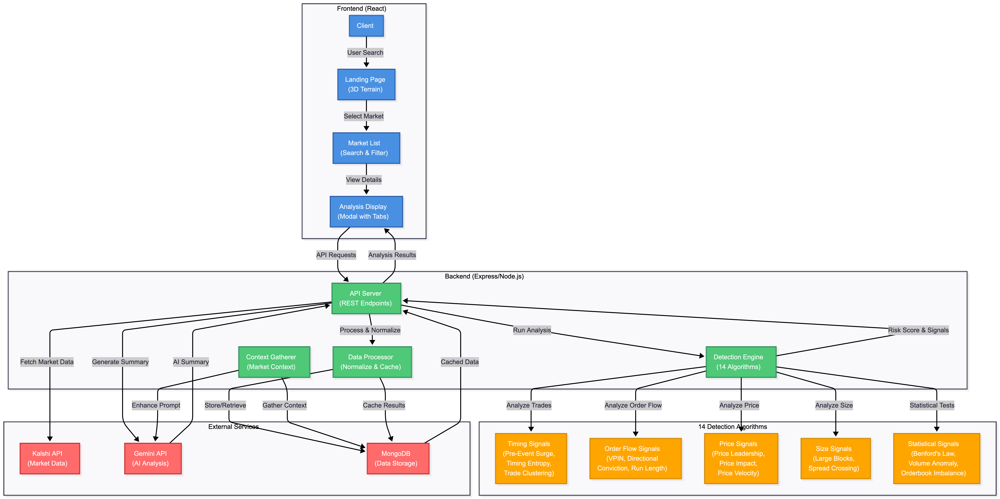

# TradeGuard

Real-time insider trading detection for prediction markets using 14 quantitative algorithms to identify suspicious trading patterns.

## Tech Stack

- **Backend**: Node.js, Express, TypeScript
- **Frontend**: React, Vite, Three.js
- **Database**: MongoDB
- **AI**: Google Gemini API
- **APIs**: Kalshi API

## Setup

### Install Dependencies
sh
cd backend
npm install

cd ../frontend
npm install

## System Architecture

*Figure: TradeGuard system architecture showing data flow from frontend through backend detection algorithms to external services.*